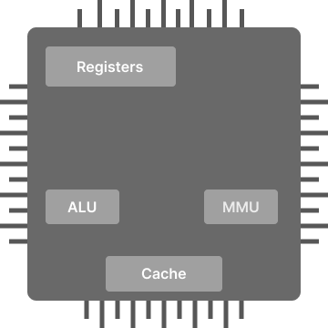

# Operating System 
## Important Terms
1. __Process ->__ Program under execution is called "process".
Only single process can run at a time in one CPU (core).  

2. __Threads ->__ Lightweight process which runs within a programs's process and shares the same memory space.

3. __Registers ->__ Very small amount of storage located within the CPU. <br/>
Used to store data that is frequently accessed or manipulated by the CPU. <br/>
Registers are faster to access memory. <br/>

    Some important registers are: 
    - __Program Counter (PC)__: Keep track of the next instruction to be executed.
    - __Stack pointer (SP)__: Holds memory address of the top of the stack.
    - __Base Pointer (BP)__: 
    - __Status Register (FLAGS)__: Store the outcome of the most recent arthematic or logical operation. e.g carry, zero, overflow flags(Allocated memory overflow if value is **1**) . 
    
<br/>

4. __PC Architecture ->__ 

    <p align="center">
    
    </p>

    - __Registers:__ High speed memory storing unit.

    - __ALU:__ (Arthematic Logic Unit) Performs all arthematic and logic operations.

    - __MMU:__ (Memory Management Unit) Converts virtual addresses into physical addresses.

    - __Cache:__ Smaller, faster memory. It stores copies of data from frequently used memory locations.


<br/>

> # Header Files
- ## __unistd.h__ (Unix-Standard)
     This Header file provides access to the __POSIX__ Operating System API.

    ```c
    #include<unistd.h>
    ```
- ## __fcntl.h__ (File-Control)
    This Header file is used to perform various file control operations on a file descriptor, such as changing the file access mode, open, close or setting file status flags.

    ```c
    #include<fcntl.h>
    ```
> # System Calls
- ## __Fork__
    - The fork() system call is used to creates duplicate copy of the parent process (called child process).
    - After the new child Process is created both the process (parent, child) will execute the next instruction.
    - Child process uses same pc(program counter) register, CPU registers, open file descriptors.
    - fork() doesn't take any argument and returns an integer value.

         ```c
        int p = fork(); 
        ```
        - __p<0__ 

            Failed to create new child processs.

        - __p=0__

            Child process is created successfully.
            In child process value of p is 0.

        - __p>0__

             In parent process value of p is the PID(process ID) of the child process.

- ## __Exec__

    - When program invokes exec system call, the operating system replaces the current process's code and data with the code and data of the new process specified by the user.
    - Exec system call replaces the current process image with a new process image.

        ```c
        int exec (const char *path, const *char argv[]);
        ```
        - __path__ -> The path of executable file. This can be absolute or relative.
        - __argv__ -> Array of argumants to be passed to executable file. The last element must be null.
    - If the return value of exec is __-1__ it means that __exec__ failed and control return to caller.
- ## __Input Output System Calls__
    - ### __Terminology__
        - __File Descriptor__ -> An integer that uniquely identifies an open file.
        - __File Descriptor Table__ -> Collection of indices of file descriptor.
        __Each process has its file descriptor table__.
        - __Standard File Descriptor__ -> By default first three entries of **FDT** are automaticaly filled.

            __Entries (FD)__
            - __0__ -> Read from **stdin**  (Keyboard)
            - __1__ -> Write to **stdout**  (Display)
            - __2__ -> Write to **stderr** (Error)
    - ### __Input/Output calls__
        - __Create__

            ```c
            int create ("file name", mode);
            ```
        - __Open__

            ```c
            int open ("path", modes);
            ```
        - __Close__

            ```c
            int close (int fd);
            ```
        - __Read__

            ```c
            size_t read (int fd, buff, sizeOfBuff);
            ```
        - __Write__

            ```c
            size_t write (int fd, buff, sizeOfBuff);
            ```
- ## __Wait__
    When a process calls the "wait" system call, the operating system blocks the parent process until one of the child process terminates, and then returns information about the child process.

    ```c
    int wait(int *status);
    int wait(NULL);
    ```

    - The "status" variable will be used to store the exit status of the child process that has terminated.
    - The exit status is stored in the "status" variable using a bit field structure. The lower 8 bits of the "status" variable store the exit code of the child process, while the upper 8 bits store additional information such as whether the child process terminated due to a signal, and if so, which signal it was.
    - The "wait" system call returns the process ID of the terminated child process to the parent process.

- ## __Waitpid__
    Similar to "wait", the only difference is that "wait" waits for any child process to terminate and collect its exit status, while "waitpid" waits for a specific child process to terminate and collect its exit status. The specific child's pid is passed to the "waitpid" as argument.

    ```c
    pid_t waitpid (pid_t pid, int *status, int options);
    ```

    __Options__ to specify additional behaviour.


- ## __Pipe__ (Inter-Process Communication)
    - used to move data between the two processes.

        ```
        Command1 --> Command2
        ```
    - used for inter-process communication
        ```c
        int pipe (int pipefd[2]);
        ```
        pipe store two file descriptors in the array passed to the pipe.
        ```c
        int fd[2];
        pipe(fd);
        fd[0]; // file descriptor for using read end (recieve data)
        fd[1]; // file descriptor for using write end (send data)
        ````
    - pipe return -1 when fails. 
- ## __Inter-Process Communication using Shared Memory__
    - System calls used:

        ```c
        int shmget(key_t key, size_t size, int shmflg); // It is used to create the shared memory senment
        void *shmat(int shmid, void *shmaddr, int shmflag); // It is used to attach the shared segment to with the process
        ```
    - In this method of communication we write two programs:
    
      - program 1: __Sender__
        
        - Create the shared segment
        - Attach to it
        - Write some content into it.

      - Program 2: __Receiver__

        - Attach itself to the shared segment
        - Read the data written by Program 1.

- ## __Signal__
    - Signal is software intrupt delivered to process or thread by the Operating System.
    - It intrupts the normal flow of execution and transfers control to a signal handler. 

        ```c
        signal(int sigNum, void handler);
        // e.g
        signal(SIGINT, handler);

        ```
        Here are some commonly used signal numbers

        __SIGINT__ (2) -> Ctrl+C
        
        __SIGTSTP__ (20) -> Ctrl+Z

        __SIGTERM__ (15) -> Termination signal

        __SIGKILL__ (9) -> Forced termination signal

        __SIGSEGV__ (11) -> Segmentation fault signal 
        